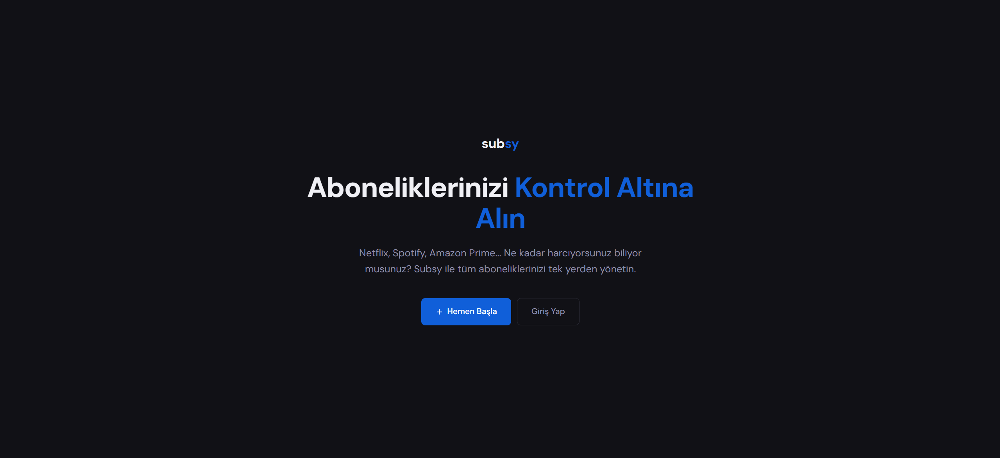
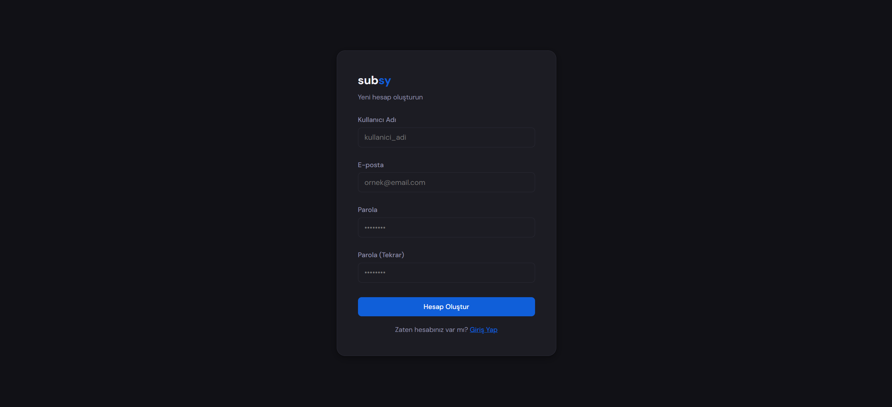
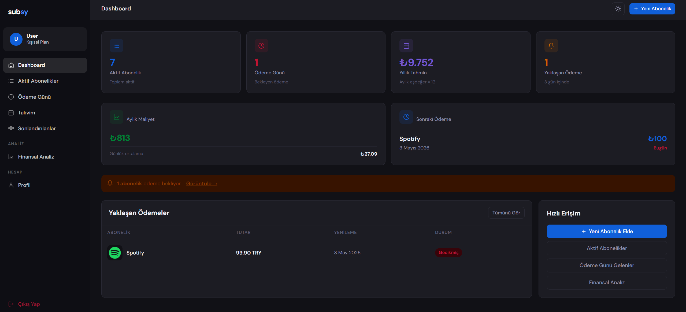
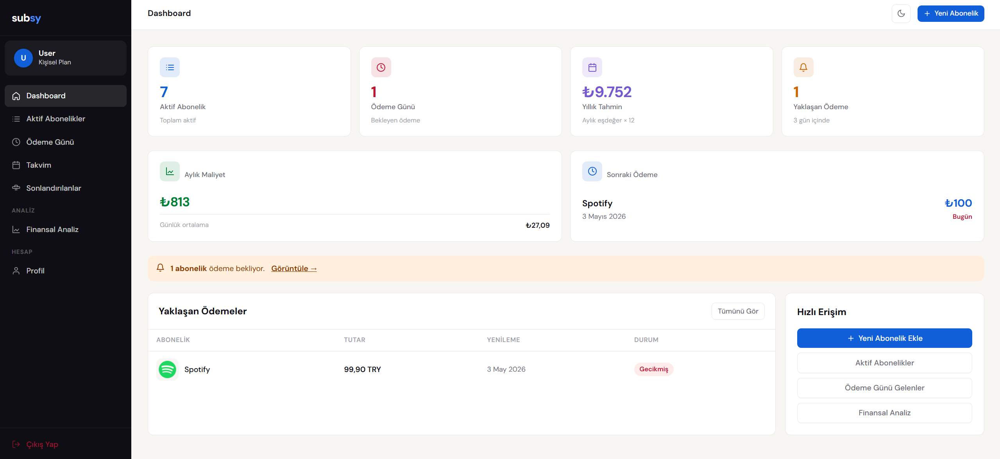
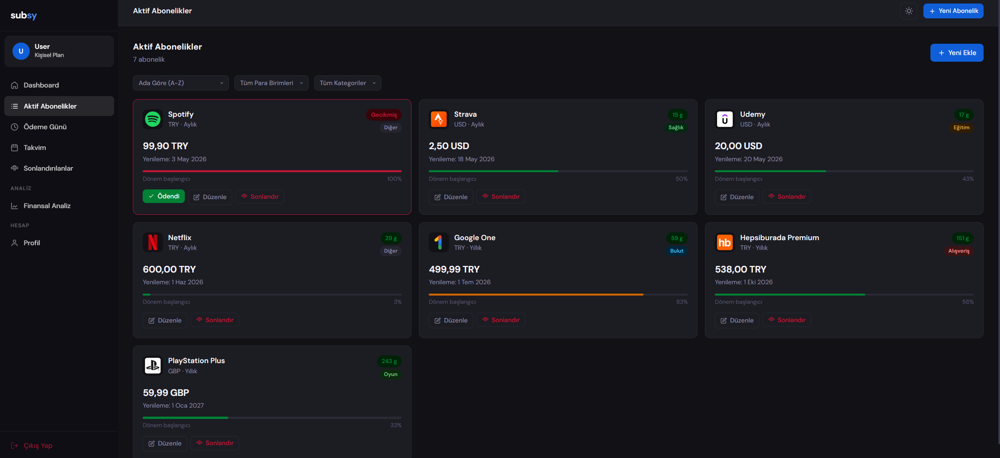
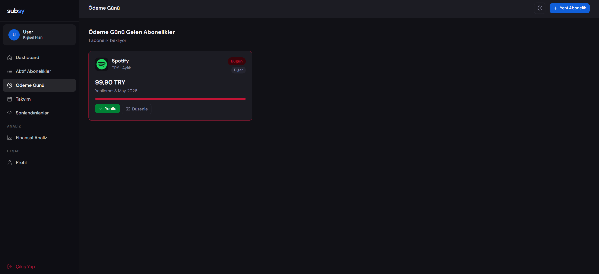
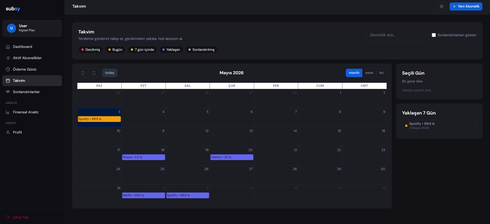
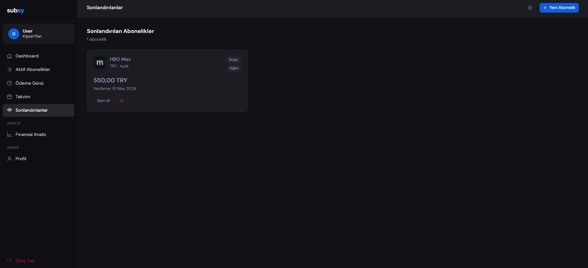
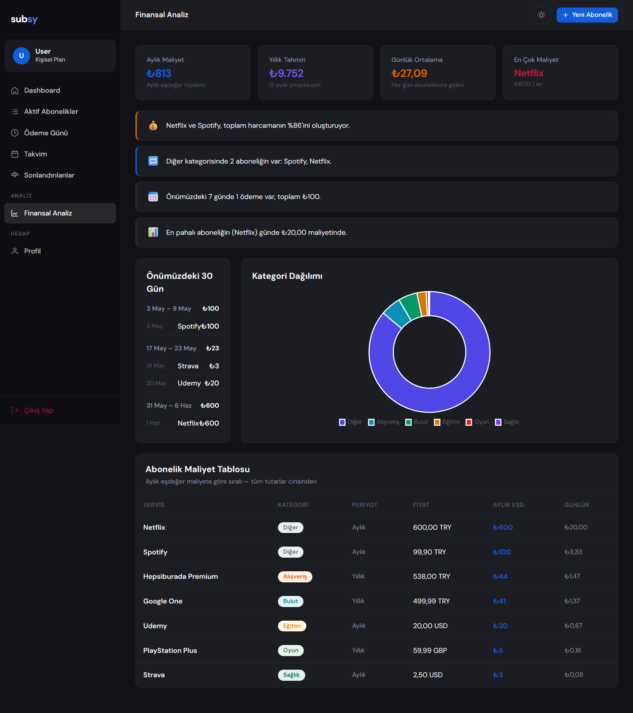

# Subsy

A **subscription management platform** built with **.NET 8** and **Clean Architecture**. Track, analyze, and stay on top of recurring payments through a modern web interface and REST API.

---

## Screenshots

**Landing Page**


**Register**


**Dashboard — Dark Mode**


**Dashboard — Light Mode**


**Active Subscriptions**


**Due Today**


**Calendar**


**Archived Subscriptions**


**Finance Analytics**


---

## Tech Stack

| Layer | Technology |
|-------|-----------|
| Backend | .NET 8, ASP.NET Core MVC & Web API |
| Architecture | Clean Architecture, CQRS (MediatR) |
| Database | Entity Framework Core + SQLite |
| Auth | ASP.NET Core Identity (Cookie + JWT) |
| Validation | FluentValidation + MediatR pipeline |
| Background Jobs | Hangfire (SQLite storage) |
| Email | MailKit (SMTP) |
| Frontend | Tailwind CSS, Chart.js, FullCalendar |
| Testing | xUnit, Moq, FluentAssertions |
| CI | GitHub Actions |

---

## Architecture

```
Subsy.Web / Subsy.Api
        |
        v
Subsy.Application  (Commands, Queries, DTOs, Validation)
        |
        v
Subsy.Domain       (Entities, Business Rules, Domain Events)
        ^
        |
Subsy.Infrastructure  (EF Core, Identity, Hangfire, Email, Storage)
```

**Dependency rule:** Domain depends on nothing. Application depends only on Domain. Infrastructure and presentation layers point inward.

The Application layer is organized by feature (`Subscriptions/`, `Finance/`, `UserProfile/`, `Admin/`), each with `Commands/` and `Queries/` subfolders following the CQRS pattern.

---

## Features

### Subscription Management
- Create, update, and delete subscriptions with 10 category types
- Archive / unarchive for inactive subscriptions
- Mark as paid with automatic next-payment renewal
- Filter by active, due today, or archived status

### Dashboard
- Active subscription count and today's due items
- Upcoming payments (next 30 days)
- Monthly and yearly spending overview
- Daily average cost calculation

### Finance Analytics
- Monthly and all-time spending breakdowns
- Most expensive subscription identification
- Category distribution (doughnut chart via Chart.js)
- Cost table with daily/monthly/yearly projections
- Smart insights and grouped service cost analysis

### Calendar
- Interactive calendar powered by FullCalendar
- Monthly, weekly, and list views
- AJAX-based dynamic event loading
- Toggle archived subscriptions visibility

### User Profile
- Username and email management
- Password change with Identity validation
- Profile photo upload (local storage or Supabase)
- Two-factor authentication (TOTP with QR code)

### Admin Panel
- User management: assign/revoke admin role, block/unblock, delete
- Subscription overview across all users
- Audit log viewer (domain events trigger automatic logging)
- Broadcast email notifications to all users
- Force logout via security stamp invalidation

### REST API
- JWT Bearer authentication (24-hour token expiry)
- Full subscription CRUD endpoints
- Swagger/OpenAPI documentation
- Independent rate limiting

### Background Jobs
- Daily payment reminder emails (8:00 AM via Hangfire)
- Subscriptions due tomorrow grouped by user
- HTML email templates via MailKit/SMTP

---

## Security

- **Rate limiting:** 60 req/min global, 10/min on login, 30/min on admin area
- **Security headers:** CSP, HSTS (1 year), X-Frame-Options DENY, X-Content-Type-Options nosniff
- **Password policy:** 8+ characters, uppercase + lowercase + digit required
- **Account lockout:** 5 failed attempts triggers 15-minute lockout
- **Email confirmation** required before login

---

## Getting Started

### Prerequisites
- [.NET 8 SDK](https://dotnet.microsoft.com/download/dotnet/8.0)

### 1. Clone and build

```bash
git clone https://github.com/emirhantopcuoglu/Subsy.git
cd Subsy
dotnet build
```

### 2. Set up external services

The project depends on three external services. You need a free account for each:

#### Mailtrap (email sandbox)
Used for sending payment reminder emails in development. Real emails are never sent — everything is caught in Mailtrap's inbox.

1. Sign up at [mailtrap.io](https://mailtrap.io)
2. Go to **Email Testing → Inboxes → SMTP Settings**
3. Select **.NET** from the integrations dropdown
4. Copy your `Host`, `Port`, `Username`, and `Password`

#### Supabase (profile photo storage)
Used for storing user profile photos.

1. Sign up at [supabase.com](https://supabase.com)
2. Create a new project
3. Go to **Project Settings → API**
4. Copy your **Project URL** and **service_role** key (not the anon key)
5. Go to **Storage** and create a bucket named `profile-photos`
6. Set the bucket to **private**

#### JWT signing key (API only)
A random secret string used to sign JWT tokens. Generate one:

```bash
# Any random string of 32+ characters works, e.g.:
openssl rand -base64 32
```

### 3. Configure secrets

Sensitive values are stored via [.NET User Secrets](https://learn.microsoft.com/en-us/aspnet/core/security/app-secrets) — they live on your machine only, never in the repository.

**Web app secrets:**

```bash
cd Subsy.Web

dotnet user-secrets set "Email:Host" "sandbox.smtp.mailtrap.io"
dotnet user-secrets set "Email:Port" "587"
dotnet user-secrets set "Email:From" "noreply@subsy.app"
dotnet user-secrets set "Email:Username" "YOUR_MAILTRAP_USERNAME"
dotnet user-secrets set "Email:Password" "YOUR_MAILTRAP_PASSWORD"

dotnet user-secrets set "Supabase:Url" "https://YOUR_PROJECT_ID.supabase.co"
dotnet user-secrets set "Supabase:ServiceKey" "YOUR_SUPABASE_SERVICE_ROLE_KEY"
dotnet user-secrets set "Supabase:BucketName" "profile-photos"

cd ..
```

**API secrets:**

```bash
cd Subsy.Api
dotnet user-secrets set "Jwt:Key" "YOUR_RANDOM_SECRET_MIN_32_CHARS"
dotnet user-secrets set "Jwt:Issuer" "Subsy"
cd ..
```

> The example files `appsettings.Development.json.example` show the expected key structure for reference.

### 4. Apply database migrations

Run from Visual Studio Package Manager Console:

```powershell
# Default Project: Subsy.Infrastructure | Startup Project: Subsy.Web
Update-Database -Project Subsy.Infrastructure -StartupProject Subsy.Web
```

Or via CLI:

```bash
dotnet ef database update --project Subsy.Infrastructure --startup-project Subsy.Web
```

### 5. Run

```bash
# Web app
dotnet run --project Subsy.Web

# REST API (separate terminal)
dotnet run --project Subsy.Api
```

### Running Tests

```bash
dotnet test
```

---

## Project Structure

```
Subsy.sln
├── Subsy.Domain/              Entities, enums, domain events
├── Subsy.Application/         CQRS handlers, DTOs, validation, interfaces
│   ├── Subscriptions/
│   ├── Finance/
│   ├── UserProfile/
│   └── Admin/
├── Subsy.Infrastructure/      EF Core, Identity, Hangfire, email, storage
├── Subsy.Web/                 MVC controllers, views, middleware
│   └── Areas/Admin/           Admin panel controllers & views
├── Subsy.Api/                 REST API controllers, JWT config, Swagger
└── Subsy.Application.Tests/   Unit tests (xUnit + Moq + FluentAssertions)
```

---

## CI/CD

GitHub Actions runs on every push and PR to `main`:
1. Restore dependencies
2. Build (Release configuration)
3. Run test suite

---

## License

This project is for educational and portfolio purposes.
